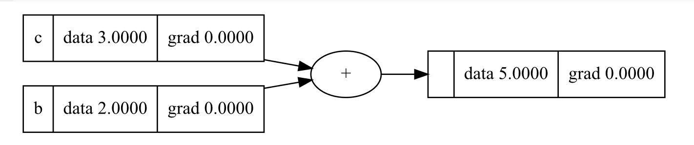

# Neural Network using micrograd by Andrej Karpathy
## Purpose
Study how pytorch processes gradients in Neural Networks. Andrej elegantly demmystifies how PyTorch calculated gradient. 
Refer to his repository here https://github.com/karpathy/micrograd.

## Modifications
Modifications to this base.
### Added draw_dot to the Value class
Allows you to visualize the computation graph for a variable. It was part of one of Andrej's tutorials. Added it to be base class.

Example:

b = Value(2.0, name="b")

c = Value(3.0, name="c")

a = b + c

a.draw_dot()

 
